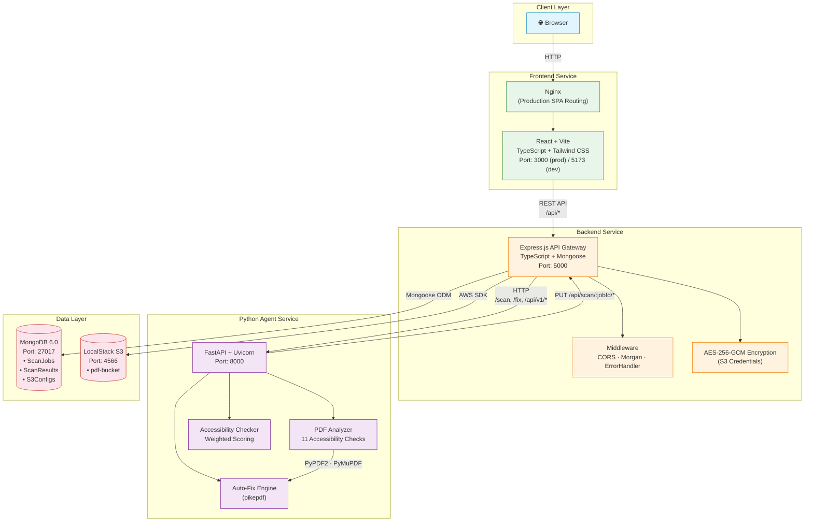
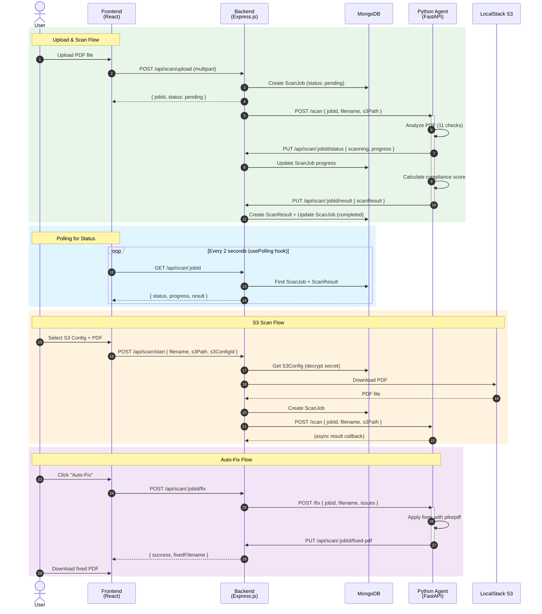
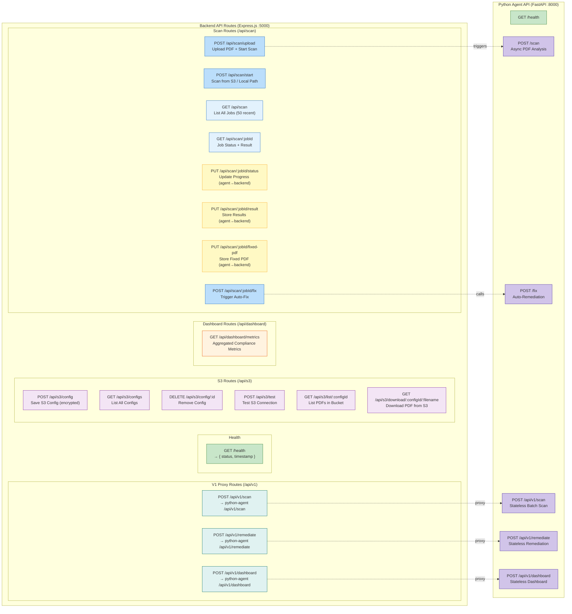
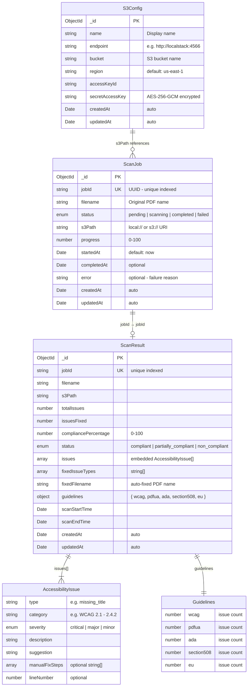
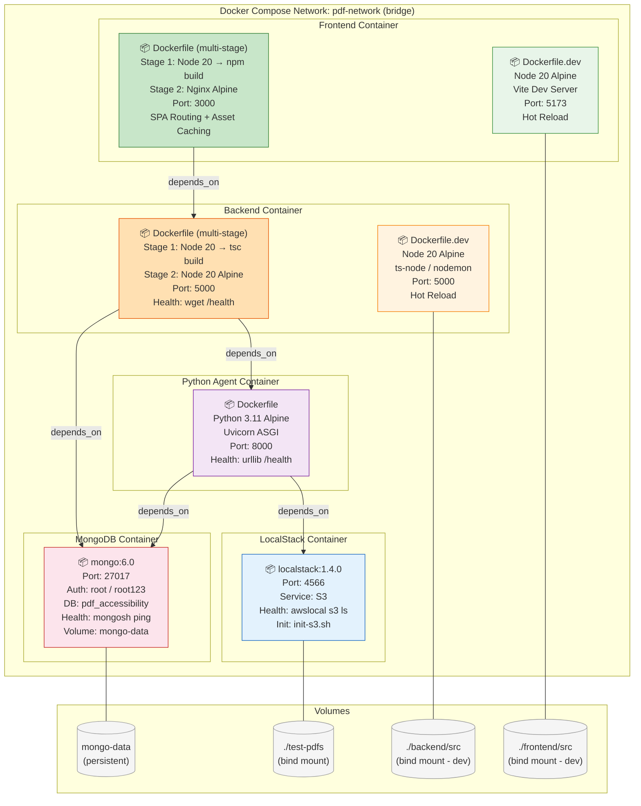
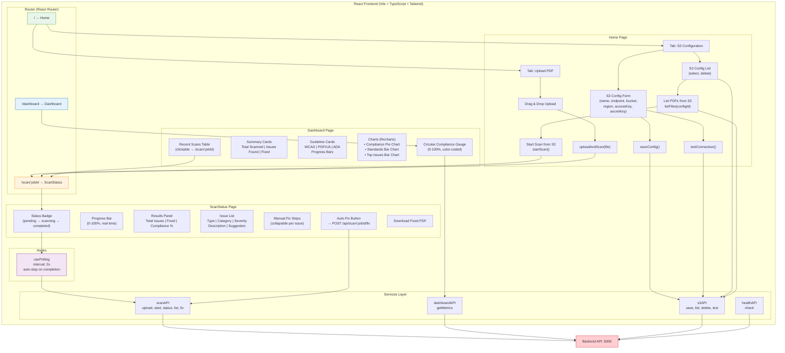

# CloudGeeks PDF Accessibility - Project Diagrams

> All diagrams use [Mermaid](https://mermaid.js.org/) syntax and render in GitHub, VS Code (with Mermaid extension), and most modern Markdown viewers.

---

## Table of Contents

1. [System Architecture Overview](#1-system-architecture-overview)
2. [Service Interaction Sequence](#2-service-interaction-sequence)
3. [API Routes Map](#3-api-routes-map)
4. [Data Model (ER Diagram)](#4-data-model-er-diagram)
5. [Docker Deployment Architecture](#5-docker-deployment-architecture)
6. [PDF Scan Workflow](#6-pdf-scan-workflow)
7. [Frontend Architecture](#7-frontend-architecture)

---

## 1. System Architecture Overview

High-level view of all services, their tech stacks, and communication paths.

---

## 2. Service Interaction Sequence

End-to-end sequence diagrams for all major flows: Upload & Scan, Polling, S3 Scan, and Auto-Fix.

---

## 3. API Routes Map

Complete map of all REST endpoints across Backend and Python Agent services.

---

## 4. Data Model (ER Diagram)

MongoDB collections, their fields, and relationships.

---

## 5. Docker Deployment Architecture

Container topology, build strategies, ports, volumes, and dependencies.

---

## 6. PDF Scan Workflow

Detailed flowchart of the complete scan pipeline — from PDF input through 11 accessibility checks to compliance scoring and auto-fix.

```mermaid
flowchart TD
    START(("PDF Input")) --> UPLOAD{"Source?"}

    UPLOAD -->|"File Upload"| MULTER["Multer saves to<br/>/backend/public/pdfs/"]
    UPLOAD -->|"S3 Source"| DECRYPT["Decrypt S3 credentials<br/>(AES-256-GCM)"]

    DECRYPT --> S3DL["Download PDF from S3<br/>(AWS SDK)"]
    S3DL --> MULTER

    MULTER --> JOB["Create ScanJob<br/>status: pending<br/>Generate UUID jobId"]
    JOB --> TRIGGER["POST /scan to Python Agent<br/>{jobId, filename, s3Path}"]

    TRIGGER --> PARSE["Parse PDF<br/>(PyPDF2 + PyMuPDF)"]

    subgraph "Python Agent: 11 Accessibility Checks"
        direction TB
        PARSE --> C1["1. Metadata<br/>(title, author, subject)"]
        C1 --> C2["2. Language Declaration<br/>(/Lang in catalog)"]
        C2 --> C3["3. Tagged Structure<br/>(StructTreeRoot + MarkInfo)"]
        C3 --> C4["4. Bookmarks/Outlines"]
        C4 --> C5["5. Font Embedding<br/>(FontFile checks)"]
        C5 --> C6["6. Images & Alt Text"]
        C6 --> C7["7. Page Content<br/>(scanned/empty detection)"]
        C7 --> C8["8. Contrast Ratio<br/>(WCAG 4.5:1 / 3:1)"]
        C8 --> C9["9. Orientation"]
        C9 --> C10["10. Text Spacing"]
        C10 --> C11["11. Images of Text"]
    end

    C11 --> SCORE["Calculate Weighted Score<br/>Tag Tree: 20% | Language: 15%<br/>Title: 10% | MarkInfo: 10%<br/>Alt Text: 10% | Bookmarks: 8%<br/>Fonts: 8% | Scanned: 8%<br/>Others: 11%"]

    SCORE --> CLASSIFY{"Compliance<br/>Classification"}
    CLASSIFY -->|"0% non-compliance"| COMP["✅ Compliant"]
    CLASSIFY -->|"1-60%"| PARTIAL["⚠️ Partially Compliant"]
    CLASSIFY -->|"61-100%"| NONCOMP["❌ Non-Compliant"]

    COMP --> MAP["Map to Standards<br/>WCAG 2.1 | PDF/UA-1<br/>ADA §508 | EU EAA"]
    PARTIAL --> MAP
    NONCOMP --> MAP

    MAP --> RESULT["PUT /api/scan/:jobId/result<br/>Store ScanResult in MongoDB"]
    RESULT --> DONE(("Scan Complete"))

    DONE --> FIX{"User requests<br/>Auto-Fix?"}
    FIX -->|"Yes"| PIKEPDF["pikepdf: Apply fixes<br/>• Add metadata<br/>• Set language<br/>• Mark structure"]
    FIX -->|"No"| MANUAL["Show Manual Fix Steps<br/>per issue"]
    PIKEPDF --> FIXED["PUT /api/scan/:jobId/fixed-pdf<br/>Store fixed PDF"]
    FIXED --> DOWNLOAD(("Download<br/>Fixed PDF"))

    style START fill:#e1f5fe,stroke:#0288d1
    style DONE fill:#c8e6c9,stroke:#2e7d32
    style DOWNLOAD fill:#c8e6c9,stroke:#2e7d32
    style COMP fill:#c8e6c9,stroke:#2e7d32
    style PARTIAL fill:#fff9c4,stroke:#f9a825
    style NONCOMP fill:#ffcdd2,stroke:#c62828
```

---

## 7. Frontend Architecture

React pages, components, services, hooks, and their data flow to the backend.

